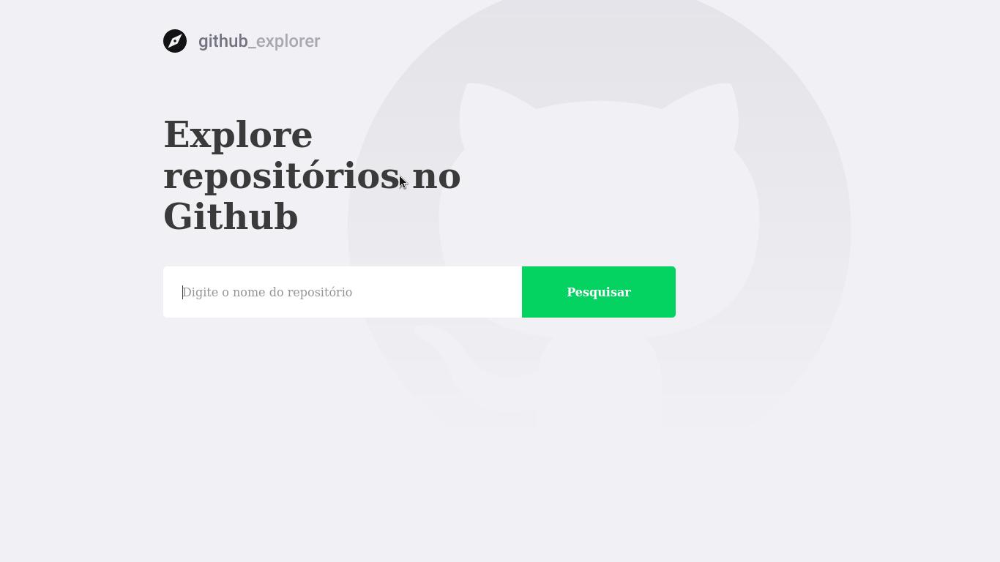
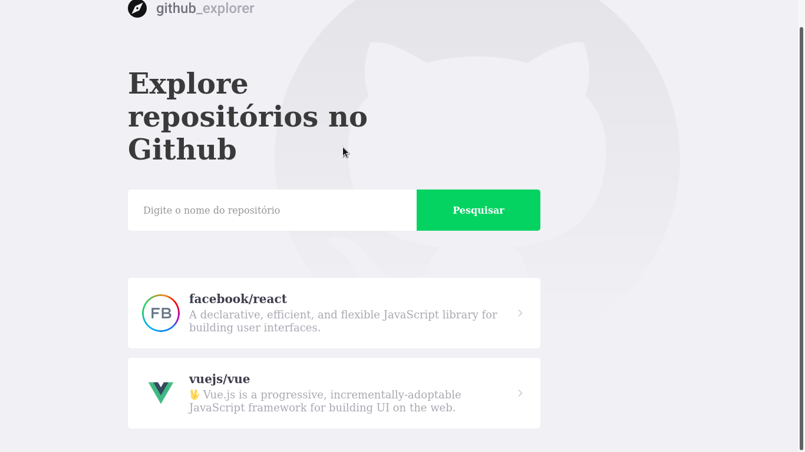
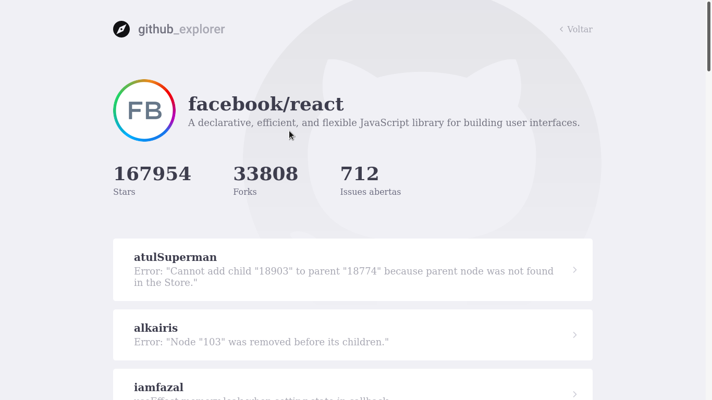

<h1 align="center">
    
</h1>

<h1 align="center">
🔎 <a href="#"> Github Explorer </a>
</h1>

<h3 align="center">
Github Explorer is an easy way to search your favorite repositories
</h3>

<p align="center">
  

  

  <a href="https://github.com/arubesu/github-explorer/commits/master">
    
  </a>
    

   
</p>


<p align="center">
 <a href="#about">About</a> •
 <a href="#features">Features</a> •
 <a href="#layout">Layout</a> •
 <a href="#how-it-works">How it works</a> •
 <a href="#tech-stack">Tech Stack</a> •
 <a href="#author">Author</a> •
 <a href="#license">License</a>

</p>


## About

🔎 Github Explorer - Github Explorer is an easy way to search your favorite repositories. You can search for repositories in github and list your issues.
Project developed during bootcamp - offered by [Rocketseat](https://blog.rocketseat.com.br/).

---

## Features

- [x] Search for repositories
- [x] List issues

---

## Layout

The application layout is available on Figma:

<a href="https://www.figma.com/file/HOCmxfrElzLpI75LdzFLia/Github-Explorer?node-id=0%3A1">
  
</a>

<p align="center" style="display: flex; align-items: flex-start; justify-content: center;">
 

 

 

---

## How it works

You can search repositories and add then to your list of repositories.

### Pre-requisites

Before you begin, you will need to have the following tools installed on your machine:
[Git] (https://git-scm.com), [Node.js] (https://nodejs.org/en/).
In addition, it is good to have an editor to work with the code like [VSCode] (https://code.visualstudio.com/)

#### Running the web application

```bash

# Clone this repository
$ git clone git@github.com:arubesu/github-explorer.git

# Access the project folder cmd/terminal
$ cd github-explorer

# install the dependencies
$ npm install

# Run the application in development mode
$ npm start

# The server will start at port: 3333 - go to http://localhost:3333

```
---

## Tech Stack

The following tools were used in the construction of the project:

#### **Website**  ([React](https://reactjs.org/) ) with ([Typescript](https://www.typescriptlang.org/))

-   **[React Router Dom](https://github.com/ReactTraining/react-router/tree/master/packages/react-router-dom)**
-   **[React Icons](https://react-icons.github.io/react-icons/)**
-   **[Axios](https://github.com/axios/axios)**
-   **[Styled Components](https://github.com/styled-components/styled-components)**

> See the file  [package.json](https://github.com/arubesu/github-explorer/blob/master/package.json)

#### **Tools**

-   Prototype:  **[Figma](https://www.figma.com/)**  →  **[Layout (Github Explorer)](https://www.figma.com/file/HOCmxfrElzLpI75LdzFLia/Github-Explorer?node-id=0%3A1)**
---
## How to contribute

1. Fork the project.
2. Create a new branch with your changes: `git checkout -b my-feature`
3. Save your changes and create a commit message telling you what you did: `git commit -m" feature: My new feature "`
4. Submit your changes: `git push origin my-feature`
> If you have any questions check this [guide on how to contribute](https://github.com/firstcontributions/first-contributions)

---

## Author

 
 <br />

 [](https://www.linkedin.com/in/bruno-a-souza/)
---

## License

This project is under the license [MIT](./LICENSE).

Made with ❤️  by Bruno Souza 👋🏽 [Get in Touch!](https://www.linkedin.com/in/bruno-a-souza/)
